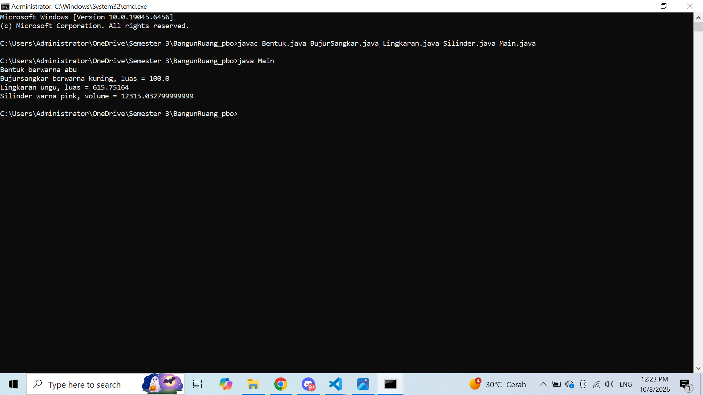

# 📐 BangunRuang_pbo

Program Java sederhana untuk mempelajari **Pemrograman Berorientasi Objek (PBO)**, khususnya **pewarisan (inheritance)**, **overriding method**, serta penjelasan penerapan **Array** dan **ArrayList** pada kelas-kelas bangun datar dan bangun ruang.

---

## 👤 Identitas

| | |
|---|---|
| **Nama** | `Suci Mustika Ramadhani` |
| **NIM** | `F1D02510093` |
| **Kelas** | `B` |
| **Mata Kuliah** | Pemrograman Berorientasi Objek (PBO) |
| **Semester** | 3 |
| **Program Studi** | `Teknik Informatika` |
| **Kampus** | `Universitas Mataram` |

---

## 📁 Struktur File

```
BangunRuang_pbo/
├── Bentuk.java          # Superclass (induk)
├── BujurSangkar.java    # Subclass dari Bentuk
├── Lingkaran.java       # Subclass dari Bentuk
├── Silinder.java        # Subclass dari Lingkaran
├── Main.java            # Class utama (program dijalankan dari sini)
├── output.png           # Screenshot hasil program
└── README.md
```

> File `.class` adalah hasil kompilasi dan tidak wajib di-upload ke GitHub.

---

## 🧩 Hierarki Class

```
Bentuk
├── BujurSangkar
└── Lingkaran
    └── Silinder
```

| Class | Parent | Atribut | Method Utama |
|---|---|---|---|
| `Bentuk` | - | `warna` | `getWarna()`, `setWarna()`, `infoPrint()` |
| `BujurSangkar` | `Bentuk` | `sisi` | `hitungLuas()`, `infoPrint()` (override) |
| `Lingkaran` | `Bentuk` | `radius`, `PHI = 3.14159` | `hitungLuas()`, `infoPrint()` (override) |
| `Silinder` | `Lingkaran` | `tinggi` | `hitungVolume()`, `infoPrint()` (override) |

### Rumus yang digunakan
- Luas bujur sangkar = `sisi × sisi`
- Luas lingkaran = `PHI × radius × radius`
- Volume silinder = `luas alas (lingkaran) × tinggi`

---

## ▶️ Cara Menjalankan

```bash
# Kompilasi
javac Bentuk.java BujurSangkar.java Lingkaran.java Silinder.java Main.java

# Jalankan
java Main
```

---

## 🖼️ Hasil Program

Perintah yang dijalankan pada `cmd`: kompilasi semua file (`Bentuk.java`, `BujurSangkar.java`, `Lingkaran.java`, `Silinder.java`, `Main.java`), lalu `java Main`.



Teks keluaran:

```
Bentuk berwarna abu
Bujursangkar berwarna kuning, luas = 100.0
Lingkaran ungu, luas = 615.75164
Silinder warna pink, volume = 12315.032799999999
```

### Penjelasan output
| Objek | Input | Perhitungan | Hasil |
|---|---|---|---|
| `Bentuk` | warna "abu" | - | Mencetak warna saja |
| `BujurSangkar` | sisi 10, "kuning" | 10 × 10 | 100.0 |
| `Lingkaran` | radius 14, "ungu" | 3.14159 × 14 × 14 | 615.75164 |
| `Silinder` | tinggi 20, radius 14, "pink" | 615.75164 × 20 | 12315.0328 (tampil `12315.032799999999` karena sifat presisi tipe `double`) |

---

## 🔁 Konsep PBO yang Diterapkan

- **Inheritance** – `BujurSangkar` dan `Lingkaran` mewarisi `Bentuk`; `Silinder` mewarisi `Lingkaran` (memakai `extends` dan `super(...)`).
- **Encapsulation** – atribut `sisi`, `radius`, `tinggi` bersifat `private` dan diakses lewat getter/setter.
- **Overriding** – setiap subclass menimpa `infoPrint()` dengan `@Override`.
- **Constant** – `PHI` dideklarasikan `public static final`.

---

## 📚 Array dan ArrayList

> **Catatan:** pada kode utama proyek ini (`Main.java`), objek dibuat satu per satu sehingga **belum menggunakan Array maupun ArrayList**. Bagian ini menjelaskan konsepnya dan bagaimana keduanya dapat diterapkan pada class-class di atas.

### Perbandingan

| | **Array** | **ArrayList** |
|---|---|---|
| Ukuran | Tetap (ditentukan saat dibuat) | Dinamis (bisa bertambah/berkurang) |
| Deklarasi | `Bentuk[] arr = new Bentuk[4];` | `ArrayList<Bentuk> list = new ArrayList<>();` |
| Tambah data | `arr[0] = objek;` | `list.add(objek);` |
| Ambil data | `arr[0]` | `list.get(0)` |
| Jumlah elemen | `arr.length` | `list.size()` |
| Hapus data | Tidak ada method khusus | `list.remove(index)` |
| Tipe elemen | Primitif & objek | Hanya objek |
| Package | Bawaan Java | `java.util.ArrayList` |

### Polimorfisme dengan Array / ArrayList
Karena `BujurSangkar`, `Lingkaran`, dan `Silinder` semuanya adalah `Bentuk`, satu array/list bertipe `Bentuk` dapat menampung semuanya. Saat `infoPrint()` dipanggil, Java menjalankan versi method milik objek yang sebenarnya (**dynamic binding**).

### Contoh implementasi (`DemoKoleksi.java`)

```java
import java.util.ArrayList;

public class DemoKoleksi {
    public static void main(String[] args) {

        // ===== 1. ARRAY (ukuran tetap) =====
        Bentuk[] arr = new Bentuk[4];
        arr[0] = new Bentuk("abu");
        arr[1] = new BujurSangkar(10, "kuning");
        arr[2] = new Lingkaran(14, "ungu");
        arr[3] = new Silinder(20, 14, "pink");

        System.out.println("=== Array ===");
        for (Bentuk b : arr) {
            b.infoPrint();
        }

        // ===== 2. ARRAYLIST (ukuran dinamis) =====
        ArrayList<Bentuk> list = new ArrayList<>();
        list.add(new Bentuk("abu"));
        list.add(new BujurSangkar(10, "kuning"));
        list.add(new Lingkaran(14, "ungu"));
        list.add(new Silinder(20, 14, "pink"));

        // Menambah data baru setelah list dibuat
        list.add(new BujurSangkar(5, "hijau"));

        // Menghapus data pada indeks ke-0
        list.remove(0);

        System.out.println("\n=== ArrayList (jumlah data: " + list.size() + ") ===");
        for (Bentuk b : list) {
            b.infoPrint();
        }
    }
}
```

Jalankan dengan:

```bash
javac DemoKoleksi.java
java DemoKoleksi
```

### Kapan memakai yang mana?
- Pakai **Array** jika jumlah data sudah pasti dan tidak berubah.
- Pakai **ArrayList** jika jumlah data bisa bertambah atau berkurang saat program berjalan.

---

## 🛠️ Teknologi

- Java (JDK 8 atau lebih baru)
- Command Prompt (`cmd`) / Visual Studio Code

---

## 📄 Lisensi

Proyek ini dibuat untuk keperluan pembelajaran mata kuliah PBO.# InheritanceandPolyrism
